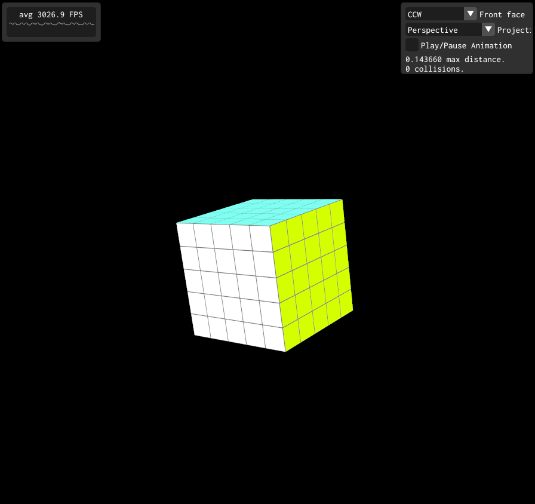

### README

- Guilherme Cesario Scagnolato - RA: 11201812319
- Victor Hugo Zaninette Bernardino - RA: 11201811443

### ABCg


Development framework accompanying the course [MCTA008-17 Computer Graphics](http://professor.ufabc.edu.br/~harlen.batagelo/cg/) at [UFABC](https://www.ufabc.edu.br/).

[Documentation](https://hbatagelo.github.io/abcg/abcg/doc/html/) | [Release notes](CHANGELOG.md)

ABCg is a lightweight C++ framework that simplifies the development of 3D graphics applications based on [OpenGL](https://www.opengl.org/), [OpenGL ES](https://www.khronos.org/), [WebGL](https://www.khronos.org/webgl/), and [Vulkan](https://www.vulkan.org/). It is designed for the tutorials and assignments of the course “MCTA008-17 Computer Graphics” taught at Federal University of ABC (UFABC).

---

# Atividade 03 - Minecraft (já está no ar, falta readme...)



## Descrição geral

- Este projeto foi desenvolvido umcom o objetivo de produzir uma aplicação 3D, e aplicar transformações geométricas a com o uso da lib ABCg, utilizando texturas e iluminação.
- Portanto desenvolvemos um cenário com texturas do jogo minecraft, onde são renderizadas algumas árvores e blocos. Além disso é possível controlar o personagem sobre uma perspectiva em terceira pessoa.
- para executar rode ```./build.sh && ./build/bin/helloworld/helloworld```
## Implementação

Abaixo será comentado as principais alterações realizadas no código.

### `texture.vert` e `texture.frag`

- Esses arquivos sofreram alterações simples em comparação com os desenvolvidos em aula, onde apenas foi removido parte do código que não seria utilizado no projeto. 

### `camera.cpp e camera.hpp`
- Esses arquivos são responsáveis por controlar a camera em terceira pessoa do jogador. O método de update recebe a posição onde o jogador se encontra na tela.

### `window.hpp`

- Para a definição da classe **Window**, foram sobrescritos seis métodos da classe OpenGLWindow.

```cpp
  void onEvent(SDL_Event const &event) override; // Gerencia enventos na tela
  void onCreate() override;  // Cria a aplicação
  void onUpdate() override;  // Atualiza a tela a
  void onPaint() override;   // Renderiza as imagens
  void onPaintUI() override; // UI
  void onResize(glm::ivec2 const &size) override; // Redimensionamento de tela
  void onDestroy() override; // Destruição da tela
```

- Além disso, foram definidas as seguintes variáveis e métodos auxiliares.

```cpp
private:
  std::default_random_engine m_randomEngine;
  glm::ivec2 m_viewportSize{};
  Model m_model;

  struct Cube {
    glm::vec3 m_position{};
    glm::vec3 m_rotationAxis{};
  };
  std::array<Cube, 125> m_cubes; // define o array com tamanho maximo para um cubo 5x5x5 (125)

  float m_angle{0.0}; // define o angulo de rotação
  bool reverse{false}; // define se a velocidade é reversa
  bool rotation{false}; // define se a rotação esta ativa
  bool m_animation{false}; // define se a animação esta pausada

  int m_trianglesToDraw{};
  int collision{0}; // define o numero de colisões que o cubo realiza no centro
  float m_distance{0.14366}; // distancia minima entre os cubinhos do cubo maior
  float m_distance_v{0.14366}; // distancia minima entre os cubinhos do cubo maior que sofre a variação de velocidade

  TrackBall m_trackBall;
  float m_zoom{2.0}; // Zoom inicial

  glm::mat4 m_modelMatrix{1.0f};
  glm::mat4 m_viewMatrix{1.0f};
  glm::mat4 m_projMatrix{1.0f};

  GLuint m_program{};

  void randomizeCube(Cube &cube);
};
```

### `window.cpp`

- Neste arquivo foram implementados todos os métodos sobrescritos no arquivo **window.hpp**.
- `onCreate()`
  No método **OnCreate** são realizadas operações, como inicialização de variáveis, carregamento dos cubos, e eixo de rotação inicial dos cubos.
  Por exemplo, quando fazemos `glm::vec3((x - 2) * m_distance, (y - 2) * m_distance, (z - 2) * m_distance)` no codigo estamos 'dizendo' que o cubo central é o cubo de posição 2 em x,y,z. ou seja o cubo central da animação 5x5x5. Além disso também aplicamos a distancia minima entre os cubinhos `m_distance` definida no `window.hpp`
  ```cpp
   void Window::onCreate() {
    auto const assetsPath{abcg::Application::getAssetsPath()};

    abcg::glClearColor(0, 0, 0, 1);
    abcg::glEnable(GL_DEPTH_TEST);
    abcg::glEnable(GL_CULL_FACE);

    m_program =
        abcg::createOpenGLProgram({{.source = assetsPath+"normalvert",
                                    stage=abcg::ShaderStage::Vertex},
                                  {.source = assetsPath+"normalfrag",
                                    .stage = abcg::ShaderStage::Fragment}});

          m_model.loadObj(assetsPath + "cube.obj");
          m_model.setupVAO(m_program);

          m_trianglesToDraw = m_model.getNumTriangles();

          std::uniform_int_distribution<int> rot_axis(0, 2);

          for (int x = 0; x < 5; x++) {
            for (int y = 0; y < 5; y++) {
              for (int z = 0; z < 5; z++) {
                m_cubes.at(x * 25 + y * 5 + z * 1).m_position = glm::vec3(
                    (x - 2) * m_distance, (y - 2) * m_distance, (z - 2) * m_distance);
                glm::vec3 current_axis{0.0};
                current_axis[rot_axis(m_randomEngine)] = glm::half_pi<float>();
                m_cubes.at(x * 25 + y * 5 + z * 1).m_rotationAxis = current_axis;
              }
            }
          }
        }
  ```

- `onEvent()`
Função utilizada para movimentar a câmera em torno do cubo mágico. com auxilio dos metodos implementados em **trackball.cpp**
    ```cpp
    void Window::onEvent(SDL_Event const &event) {
      glm::ivec2 mousePosition;
      SDL_GetMouseState(&mousePosition.x, &mousePosition.y);

      if (event.type == SDL_MOUSEMOTION) {
        m_trackBall.mouseMove(mousePosition);
      }
      if (event.type == SDL_MOUSEBUTTONDOWN &&
          event.button.button == SDL_BUTTON_LEFT) {
        m_trackBall.mousePress(mousePosition);
      }
      if (event.type == SDL_MOUSEBUTTONUP &&
          event.button.button == SDL_BUTTON_LEFT) {
        m_trackBall.mouseRelease(mousePosition);
      }
      if (event.type == SDL_MOUSEWHEEL) {
        m_zoom += (event.wheel.y > 0 ? -1.0f : 1.0f) / 5.0f;
        m_zoom = glm::clamp(m_zoom, -1.5f, 1.0f);
      }
    }
    ```

- `onUpdate()`
No método **onUpdate** o cubo é sofre todas as transformações, seja rotação ou distanciamento entre cada cubinho.
  ```cpp
    void Window::onUpdate() {
      std::uniform_int_distribution<int> rot_axis(0, 2);
      auto const deltaTime{gsl::narrow_cast<float>(getDeltaTime())};
      float m_distance_aux = m_distance;
      m_modelMatrix = m_trackBall.getRotation();

      m_viewMatrix =
          glm::lookAt(glm::vec3(0.0f, 0.0f, 2.0f + m_zoom),
                      glm::vec3(0.0f, 0.0f, 0.0f), glm::vec3(0.0f, 1.0f, 0.0f));

      if (!m_animation) {
        return;
      }
    ```

  Após iniciar a animação o cubo começa a se distanciar, até que atinge uma distancia maxima `0.7`, após atingir essa distancia a velicidade sofre uma inversão de sinal, até colidir no centro outra vez e o sinal da  velocidade inverter novamente. Cada colisão aumenta a velocidade até um treshold de `1.5`.
    ```cpp
      float collision_speed = ((0.05 * collision) < 1.5) ? (0.05 * collision) : 1.5;
      if (!reverse) {
        m_distance_v =
            glm::wrapAngle(m_distance_v + (0.5 + collision_speed) * deltaTime);
      } else {
        m_distance_v =
            glm::wrapAngle(m_distance_v - (0.5 + collision_speed) * deltaTime);
      }

      if (m_distance_v >= 0.7 && !reverse) {
        reverse = !reverse;
      } else if (m_distance_v <= m_distance_aux && reverse) {
        reverse = !reverse;
        collision = collision + 1;
      }
    ```

    O fragmento de codigo abaixo é responsável pelo distanciamento das fileiras de cubinhos, no fragmento as velocidades são calculadas e aqui são aplicadas, além disso também checamos a variavel `collision` para saber em qual eixo devemos lançar e distanciar os cubinhos.
    ```cpp
      if ((collision % 2) == 0) {
        for (int x = 0; x < 5; x++) {
          for (int y = 0; y < 5; y++) {
            for (int z = 0; z < 5; z++) {
              m_cubes.at(x * 25 + y * 5 + z * 1).m_position =
                  glm::vec3((x - 2) * m_distance_v, (y - 2) * m_distance_aux,
                            (z - 2) * m_distance_aux);
            }
          }
        }
      } else if ((collision % 3) == 0) {
        for (int x = 0; x < 5; x++) {
          for (int y = 0; y < 5; y++) {
            for (int z = 0; z < 5; z++) {
              m_cubes.at(x * 25 + y * 5 + z * 1).m_position =
                  glm::vec3((x - 2) * m_distance_aux, (y - 2) * m_distance_aux,
                            (z - 2) * m_distance_v);
            }
          }
        }
      } else {
        for (int x = 0; x < 5; x++) {
          for (int y = 0; y < 5; y++) {
            for (int z = 0; z < 5; z++) {
              m_cubes.at(x * 25 + y * 5 + z * 1).m_position =
                  glm::vec3((x - 2) * m_distance_aux, (y - 2) * m_distance_v,
                            (z - 2) * m_distance_aux);
            }
          }
        }
      }
    ```
    - O fragmento de codigo abaixo é responsável pela rotação de cada cubinho, vale notar que sempre que a distancia entre as fileiras é proxima do minimo permitido m_distance, a rotação sofre uma pausa, e assim que a distancia aumenta, ela volta a acontecer. Note que temos uma regra para checar cada valor de `m_angle` e saber como rotacionar cada cubinho.
    ```cpp
    if (rotation) {
      m_angle = m_angle + glm::half_pi<float>() * deltaTime;
      if (m_angle > glm::half_pi<float>() * 4 &&
          m_angle < glm::half_pi<float>() * 4) {
        m_angle = 0.0;
        for (int x = 0; x < 5; x++) {
          for (int y = 0; y < 5; y++) {
            for (int z = 0; z < 5; z++) {
              glm::vec3 current_axis{0.0};
              current_axis[rot_axis(m_randomEngine)] = glm::half_pi<float>();
              m_cubes.at(x * 25 + y * 5 + z * 1).m_rotationAxis = current_axis;
            }
          }
        }
      } else if (m_angle > glm::half_pi<float>() * 3 &&
                m_angle <= glm::half_pi<float>() * 3) {
        m_angle = glm::half_pi<float>() * 3;
      } else if (m_angle > glm::half_pi<float>() * 2 &&
                m_angle <= glm::half_pi<float>() * 2) {
        m_angle = glm::half_pi<float>() * 2;
      } else if (m_angle > glm::half_pi<float>() &&
                m_angle <= glm::half_pi<float>()) {
        m_angle = glm::half_pi<float>();
      }
    }
    ```

- `onPaint()`
    - No método **onPaint** são desenhados os objetos da aplicação.
    - Em especial aqui, são aplicadas dois tipos de transformação sobre os cubos, começando com translação, escalonamento e rotação do cubo como um objeto só, e depois algumas transformações para adequar o cubo à visão de perspectiva ou ortográfica.
- `onPaintUI()`
    - No método **onPaintUI** são desenhados os elementos de UI da tela.
    - Aqui boa parte dos elementos foram reaproveitados do projeto Viewer 2, como a seleção de visão por perspectiva ou ortográfica e direção de criação das faces, mas foi adicionado também um botão para pausar/retomar a animação, e um texto mostrando a atualização das distâncias entre cubos em tempo real.
- `onResize()`
    - No método **onResize** é a função para adaptar a tela quando sofre um redicionamento.
- `onDestroy()`
    - No método **onDestroy** é onde a função que serve para apagar todos os elementos quando a janela da aplicação for fechada.

## Demonstração (clique no GIF)


---

## License

ABCg is licensed under the MIT License. See [LICENSE](https://github.com/hbatagelo/abcg/blob/main/LICENSE) for more information.
