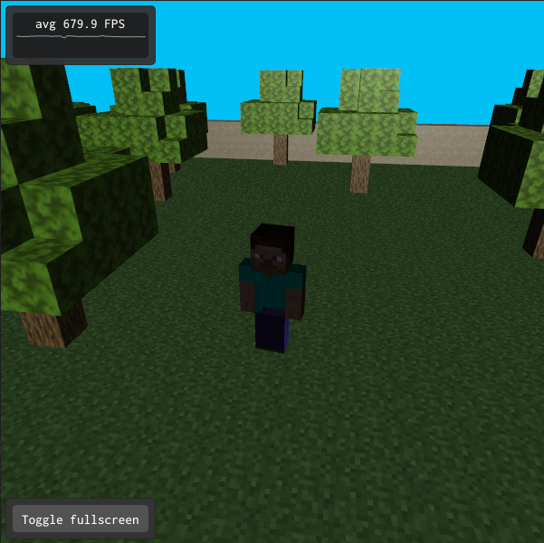

### README

- Guilherme Cesario Scagnolato - RA: 11201812319
- Victor Hugo Zaninette Bernardino - RA: 11201811443

### ABCg


Development framework accompanying the course [MCTA008-17 Computer Graphics](http://professor.ufabc.edu.br/~harlen.batagelo/cg/) at [UFABC](https://www.ufabc.edu.br/).

[Documentation](https://hbatagelo.github.io/abcg/abcg/doc/html/) | [Release notes](CHANGELOG.md)

ABCg is a lightweight C++ framework that simplifies the development of 3D graphics applications based on [OpenGL](https://www.opengl.org/), [OpenGL ES](https://www.khronos.org/), [WebGL](https://www.khronos.org/webgl/), and [Vulkan](https://www.vulkan.org/). It is designed for the tutorials and assignments of the course “MCTA008-17 Computer Graphics” taught at Federal University of ABC (UFABC).

---

# Atividade 03 - Minecraft Arena



## Descrição geral

- Este projeto foi desenvolvido umcom o objetivo de produzir uma aplicação 3D, e aplicar transformações geométricas a com o uso da lib ABCg, utilizando texturas e iluminação.
- Portanto desenvolvemos um cenário com texturas do jogo minecraft, onde são renderizadas algumas árvores e blocos. Além disso é possível controlar o personagem sobre uma perspectiva em terceira pessoa.
- para executar rode ```./build.sh && ./build/bin/helloworld/helloworld```
## Implementação

Abaixo será comentado as principais alterações realizadas no código.

### `texture.vert` e `texture.frag`

- Esses arquivos sofreram alterações simples em comparação com os desenvolvidos em aula, onde apenas foi removido parte do código que não seria utilizado no projeto.

### `camera.cpp e camera.hpp`
- Esses arquivos são responsáveis por controlar a camera em terceira pessoa do jogador. O método de update recebe a posição onde o jogador se encontra na tela.

### `window.hpp`

- Para a definição da classe **Window**, foram sobrescritos seis métodos da classe OpenGLWindow.

```cpp
  void onEvent(SDL_Event const &event) override; // Gerencia enventos na tela
  void onCreate() override;  // Cria a aplicação
  void onUpdate() override;  // Atualiza a tela a
  void onPaint() override;   // Renderiza as imagens
  void onResize(glm::ivec2 const &size) override; // Redimensionamento de tela
  void onDestroy() override; // Destruição da tela
```

- Além disso, foram definidas as seguintes variáveis e métodos auxiliares.

```cpp
private:
  glm::ivec2 m_viewportSize{};

  Model m_protagonist; // modelo do personagem
  Model m_ground; // modelo do gramado
  Model m_sand; // modelo das paredes
  Model m_tree; // modelo das arvores

  GameData m_gameData;

  glm::vec3 m_position{0.0f, 1.8f, 0.0f}; // vetor de posição do personagem
  glm::vec3 m_direction{0.0f, 0.0f, 1.0f}; // vetor de direções
  float m_angle{glm::radians(-90.0f)}; // angulação do personagem

  Camera m_camera; // 'instancia' a camera

  float lastX = 300, lastY = 300;
  float yaw = -90.0f;
  float pitch = 0.0f;
  float sensitivity = 0.1f;
  glm::ivec2 mousePosition; // posição do mouse

  glm::mat4 m_viewMatrix{1.0f};
  glm::mat4 m_projMatrix{1.0f};

  GLuint m_program_obj{};

  bool control = false;
  void checkCollision();

  // propedades da iluminação
  glm::vec4 m_Ia{1.0f};
  glm::vec4 m_Id{1.0f};
  glm::vec4 m_Is{1.0f};
  glm::vec4 m_Ka{};
  glm::vec4 m_Kd{};
  glm::vec4 m_Ks{};
  float m_shininess{};

  std::vector<glm::vec2> m_treePositions = {...} // define posição 2d das arvores (x, z)
};
```

### `window.cpp`

- Neste arquivo foram implementados todos os métodos sobrescritos no arquivo **window.hpp**.
- `onCreate()`
  No método **OnCreate** são realizadas operações, como inicialização de variáveis, carregamento modelos e texturas, tamanho dos modelos, fontes de luz.
  Por exemplo, quando executamos os comandos abaixo:
    - `m_protagonist.loadDiffuseTexture(assetsPath +"maps/Minecraft_steve_skin.jpg");`
    - `m_protagonist.setSize(10.0f);`
    - `m_protagonist.loadObj(assetsPath + "minecraft_steve.obj");`
    - `m_protagonist.setupVAO(m_program_obj);`
    - ` m_shininess = m_protagonist.getShininess();`

  ```cpp
  void Window::onCreate() {
    auto const assetsPath{abcg::Application::getAssetsPath()};

    abcg::glClearColor(0, 0.753, 0.961, 1);
    abcg::glEnable(GL_DEPTH_TEST);

    m_program_obj =
        abcg::createOpenGLProgram({{.source = assetsPath + "shaders/texture.vert",
                                    .stage = abcg::ShaderStage::Vertex},
                                  {.source = assetsPath + "shaders/texture.frag",
                                    .stage = abcg::ShaderStage::Fragment}});

    m_protagonist.loadDiffuseTexture(assetsPath +
                                    "maps/Minecraft_steve_skin.jpg");
    m_protagonist.setSize(10.0f);
    m_protagonist.loadObj(assetsPath + "minecraft_steve.obj");
    m_protagonist.setupVAO(m_program_obj);

    m_Ka = m_protagonist.getKa();
    m_Kd = m_protagonist.getKd();
    m_Ks = m_protagonist.getKs();
    m_shininess = m_protagonist.getShininess();

    m_ground.loadDiffuseTexture(assetsPath + "maps/Grass_Block_TEX.png");
    m_ground.loadObj(assetsPath + "Grass_Block.obj");
    m_ground.setupVAO(m_program_obj);

    m_sand.loadDiffuseTexture(assetsPath + "maps/sand.png");
    m_sand.loadObj(assetsPath + "sand.obj");
    m_sand.setupVAO(m_program_obj);

    m_tree.setSize(4.0f);
    m_tree.loadDiffuseTexture(assetsPath + "maps/Mineways2Skfb-RGBA.png");
    m_tree.loadObj(assetsPath + "Mineways2Skfb.obj");
    m_tree.setupVAO(m_program_obj);
  }
  ```

- `onEvent()`
Função utilizada para movimentar a câmera em torno do protagonista assim como capturar os comandos para movimentar o protagonista em torno da arena.
As teclas para cima e para baixo movem o personagem para frente e para trás, já as setas esquerda e direita rotacionam o personagem em torno do proprio eixo.

    ```cpp
      void Window::onEvent(SDL_Event const &event) {
        if (event.type == SDL_KEYDOWN) {
          if (event.key.keysym.sym == SDLK_UP || event.key.keysym.sym == SDLK_w)
            m_gameData.m_input.set(gsl::narrow<size_t>(Input::Up));
          if (event.key.keysym.sym == SDLK_DOWN || event.key.keysym.sym == SDLK_s)
            m_gameData.m_input.set(gsl::narrow<size_t>(Input::Down));
          if (event.key.keysym.sym == SDLK_LEFT || event.key.keysym.sym == SDLK_a)
            m_gameData.m_input.set(gsl::narrow<size_t>(Input::Left));
          if (event.key.keysym.sym == SDLK_RIGHT || event.key.keysym.sym == SDLK_d)
            m_gameData.m_input.set(gsl::narrow<size_t>(Input::Right));
        }
        if (event.type == SDL_KEYUP) {
          if (event.key.keysym.sym == SDLK_UP || event.key.keysym.sym == SDLK_w)
            m_gameData.m_input.reset(gsl::narrow<size_t>(Input::Up));
          if (event.key.keysym.sym == SDLK_DOWN || event.key.keysym.sym == SDLK_s)
            m_gameData.m_input.reset(gsl::narrow<size_t>(Input::Down));
          if (event.key.keysym.sym == SDLK_LEFT || event.key.keysym.sym == SDLK_a)
            m_gameData.m_input.reset(gsl::narrow<size_t>(Input::Left));
          if (event.key.keysym.sym == SDLK_RIGHT || event.key.keysym.sym == SDLK_d)
            m_gameData.m_input.reset(gsl::narrow<size_t>(Input::Right));
        }

        if (event.type == SDL_MOUSEWHEEL) {
          m_camera.zoom(event.wheel.y);
        }

        glm::ivec2 mousePosition;
        SDL_GetMouseState(&mousePosition.x, &mousePosition.y);

        if (event.type == SDL_MOUSEMOTION) {
          m_camera.mouseMove(mousePosition);
        }
        if (event.type == SDL_MOUSEBUTTONDOWN &&
            event.button.button == SDL_BUTTON_LEFT) {
          m_camera.mousePress(mousePosition);
        }
        if (event.type == SDL_MOUSEBUTTONUP &&
            event.button.button == SDL_BUTTON_LEFT) {
          m_camera.mouseRelease();
        }
      }
    ```

- `onUpdate()`
No método **onUpdate** é onde todas as transformações ocorrem, seja rotação do personagem movimentação, check de colisão.

No fragmento de código abaixo é onde é calculada a direção(angulação) que o personagem está olhando, com auxilio das funções `wrapAngle` e funções trigonométricas como `sin, cos, radians`. Além disso também é calculado a proximo movimento do personagem i.e. sua posição na arena, usamos a variavel `m_position_mv` para guardar a proxima posição do personagem.
  ```cpp
    void Window::onUpdate() {
      auto const deltaTime{gsl::narrow_cast<float>(getDeltaTime())};
      auto const N{20};
      bool colide = false;
      auto m_position_mv = m_position;

      if (m_gameData.m_input[static_cast<size_t>(Input::Left)]) {
        m_angle = glm::wrapAngle(m_angle + glm::radians(135.0f) * deltaTime);
        m_direction =
            glm::vec3(-glm::cos(m_angle + PI), 0.0f, glm::sin(m_angle + PI));
      }
      if (m_gameData.m_input[static_cast<size_t>(Input::Right)]) {
        m_angle = glm::wrapAngle(m_angle - glm::radians(135.0f) * deltaTime);
        m_direction =
            glm::vec3(-glm::cos(m_angle + PI), 0.0f, glm::sin(m_angle + PI));
      }
      if (m_gameData.m_input[static_cast<size_t>(Input::Up)])
        m_position_mv += m_direction * deltaTime * 4.5f;
      if (m_gameData.m_input[static_cast<size_t>(Input::Down)])
        m_position_mv -= m_direction * deltaTime * 4.5f;
  ```
  Após calcular a angulação e a proxima posição do personagem, é feito o check de colisão, para isso usamos o snippet abaixo.
  ```cpp
      for (auto const z : m_treePositions) {
        float x = z[0];
        float y = z[1];

        if ( !(m_position_mv[0]+0.75f <= x || m_position_mv[0]-0.75f >= x) ){
          if ( !(m_position_mv[2]+0.75f <= y || m_position_mv[2]-0.75f >= y) ) {
            colide = true;
            break;
          }
        }
      }
      if (m_position_mv[0]+1.0f >= N || m_position_mv[0]-1.0f <= -N || m_position_mv[2]-1.0f <= -N || m_position_mv[2]+1.0f >= N){
        colide = true;
      }
      if (colide == false){
        m_position = m_position_mv;
      }
      m_camera.update(m_position);
  ```

### Sistema de colisão:
- `No caso de colisão personagem x arvore`: Para cada arvore é captura a proxima posição dopersonagem e é feito a checagem se a proxima posição do personagem está no raio de alguma arvore,se a proximo posição estiver no raio de uma arvore a flag `colide` se torna `true` e a m_positionque é a posição real do personagem não é atualizada.
- `No caso de colisão personagem x parede da arena`: É feita uma checagem se a proxima posição dopersonagem ultrapassa os limites da arena (que no codigo é representado pela constante N=20) se aproxima posição do personagem estiver fora da arena a flag `colide` se torna `true` e am_position que é a posição real do personagem não é atualizada.
- `Não há colisão`: Se em nenhum momento do `onUpdate()` a variavel se tornou `true` a variavel`m_position` é atualizada com o valor de `m_position_mv`, e o personagem se move.

- `onPaint()`
    - No método **onPaint** são desenhados os objetos da aplicação.
    - Em especial, nesta função é definida as variaveis referente a iluminação. Por exemplo em:
    ```cpp
    auto const lightDirRotated{glm::vec4(0.0f, 0.0f, 1.0f, 1.0f)};
      abcg::glUniform4fv(lightDirLoc, 1, &lightDirRotated.x);
      ...
      abcg::glUniform4fv(KaLoc, 1, &m_Ka.x);
      abcg::glUniform4fv(KdLoc, 1, &m_Kd.x);
      abcg::glUniform4fv(KsLoc, 1, &m_Ks.x);
      abcg::glUniform1f(shininessLoc, m_shininess);
    ```
    - Além disso também é renderizado o protagonista, as paredes, o solo e as arvores:
    ```cpp
    auto const lightDirRotated{glm::vec4(0.0f, 0.0f, 1.0f, 1.0f)};
      // render do personagem
      m_protagonist.render();
      auto const N{20}; // tamanho da arena
      for (auto const z : iter::range(-N, N + 1)) {
        for (auto const x : iter::range(-N, N + 1)) {
          // Set model matrix as a translation matrix
          glm::mat4 model{1.0f};
          model = glm::translate(model, glm::vec3(x, 0.0f, z));
          abcg::glUniformMatrix4fv(modelMatrixLoc, 1, GL_FALSE, &model[0][0]);
          //render do solo
          m_ground.render();
          //render das paredes
          if (z == -N || z == N || x == -N || x == N) {
            glm::mat4 model1{1.0f};
            glm::mat4 model2{1.0f};
            model1 = glm::translate(model1, glm::vec3(x, 1.15f, z));
            model2 = glm::translate(model2, glm::vec3(x, 2.30f, z));
            abcg::glUniformMatrix4fv(modelMatrixLoc, 1, GL_FALSE, &model1[0][0]);
            m_sand.render();
            abcg::glUniformMatrix4fv(modelMatrixLoc, 1, GL_FALSE, &model2[0][0]);
            m_sand.render();
          }
        }
      }
      // render das arvores, note que o vetor 2d definido no window.hpp é tranformado em 3d onde y=3.0f
      for (auto const z : m_treePositions) {
        glm::mat4 model{1.0f};
        model = glm::translate(model, glm::vec3(z[0], 3.0f, z[1]));
        abcg::glUniformMatrix4fv(modelMatrixLoc, 1, GL_FALSE, &model[0][0]);
        m_tree.render();
      }
    ```

- `onResize()`
    - No método **onResize** é a função para adaptar a tela quando sofre um redicionamento.

- `onDestroy()`
    - No método **onDestroy** é onde a função que serve para apagar todos os elementos quando a janela da aplicação for fechada.

## Demonstração (clique no GIF)


---

## License

ABCg is licensed under the MIT License. See [LICENSE](https://github.com/hbatagelo/abcg/blob/main/LICENSE) for more information.
